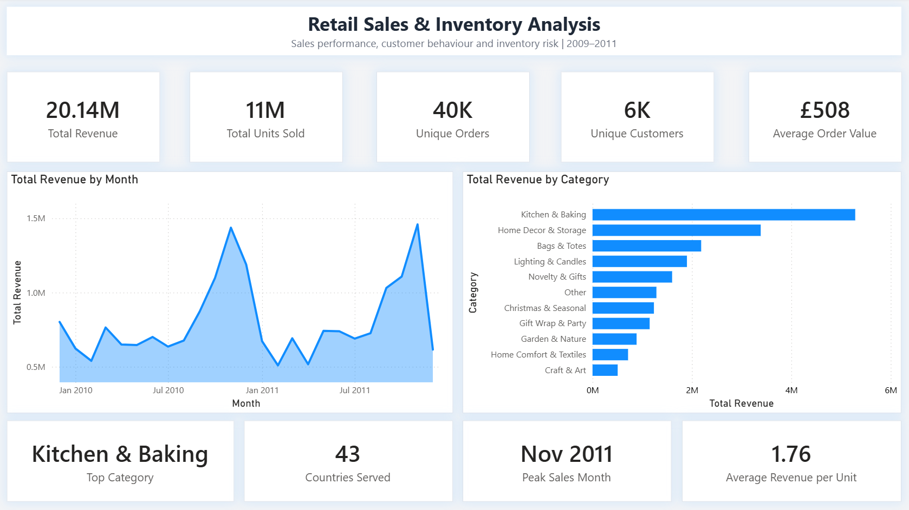
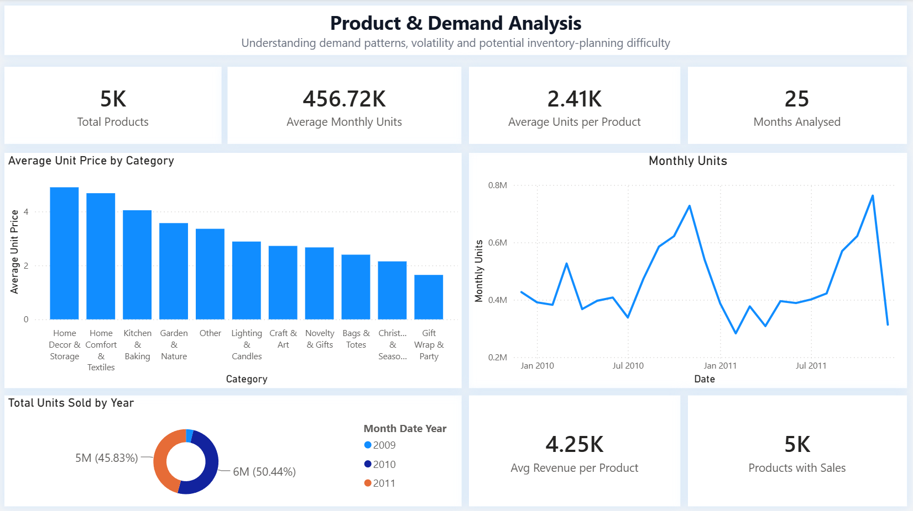
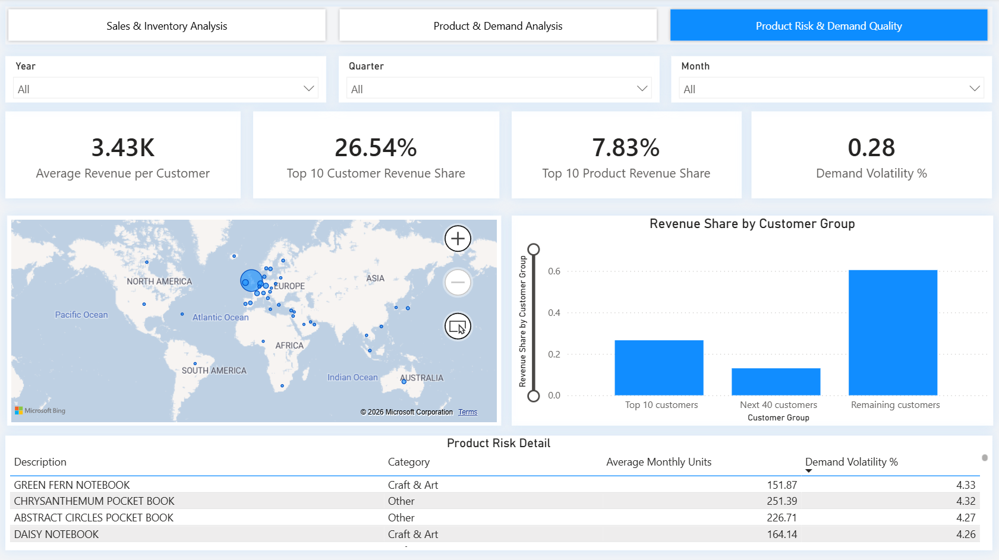

# Retail Sales, Demand & Revenue Risk Analysis

An end-to-end data analytics project using the UCI Online Retail II dataset to investigate where a retail business's revenue is most exposed to risk (unpredictable demand, order cancellations, and customer concentration) and what that means for inventory and demand planning.

The project uses Python for data cleaning and preparation, MySQL/SQL for analytical analysis, and Power BI for interactive reporting and visualisation. The analysis concludes with evidence-based business recommendations tied directly to the findings.

---

## Business Question

**Where is this business's revenue most exposed to risk, and which product categories, products, and customer segments should be prioritised to manage that risk?**

This is investigated from three angles, each corresponding to one dashboard page:

1. **Demand risk**: which categories and products combine high demand with high volatility, making them hardest to forecast and stock accurately (Page 2 & 3)
2. **Cancellation risk**: which categories see the largest share of orders cancelled, representing lost or reversed revenue (Python analysis)
3. **Concentration risk**: how dependent the business is on a small number of customers or products, and what that means for revenue stability (Page 3)

---

## Dataset

**UCI Online Retail II**

The dataset contains approximately 1 million transaction line items from a UK-based online retailer covering **December 2009 to December 2011**.

Each row represents a product line within a customer invoice.

The original dataset contains:

- Invoice number
- Stock code
- Product description
- Quantity
- Invoice date
- Unit price
- Customer ID
- Country

The raw dataset is not included in this repository due to file size. It can be obtained from the [UCI Machine Learning Repository](https://archive.ics.uci.edu/dataset/502/online+retail+ii).

---

## Tools & Technologies

| Tool | Purpose |
|---|---|
| **Python (pandas)** | Data cleaning, quality checks, product categorisation, cancellation-rate analysis |
| **MySQL / SQL** | Demand benchmarking, product risk identification, category and customer analysis |
| **Power BI / DAX** | Interactive dashboards, KPIs and visual analysis |

---

## Analytical Pipeline

```text
Raw Excel Data
      │
      ▼
Python
Data cleaning & preparation
Product categorisation
Cancellation-rate analysis (full dataset)
      │
      ▼
Cleaned Sales Dataset (completed sales only)
      │
      ▼
MySQL / SQL
Demand analysis
Product risk analysis
Category & customer analysis
      │
      ▼
Power BI
Interactive dashboards
      │
      ▼
Key Findings → Business Recommendations
```

## Repository Structure
```text
├── data_cleaning.ipynb
├── retail_analysis.sql
├── retail_dashboards.pbix
├── images/
│   ├── dashboard_1.png
│   ├── dashboard_2.png
│   └── dashboard_3.png
└── README.md
```

> **Note:** The raw and cleaned datasets are not included in the repository due to file size.

---

## Data Cleaning & Preparation

The raw dataset contained several data-quality issues. Each was investigated with evidence before deciding how to handle it, rather than resolved by default assumption:

| Issue | Finding | Decision |
|---|---|---|
| **Missing Customer ID** | ~23% of records had no customer identifier | Retained, since the main analysis is category/revenue-level, not customer-level. Flagged as a limitation for any future customer-level work |
| **Cancelled orders** | Identified using C-prefixed invoice numbers | Separated from normal sales and excluded from the cleaned sales dataset used in SQL/Power BI |
| **Negative quantities outside cancellations** | 100% of these rows had no Customer ID, with descriptions such as "damages", "missing", "thrown away", "unsaleable, destroyed" | Identified as internal stock write-offs, not customer transactions. Removed |
| **Zero-price records** | 95% had no Customer ID and the same adjustment-style descriptions; the remaining 5% were tied to genuine customers | Adjustment records removed; genuine customer records (likely free items/promotional add-ons) retained |
| **Duplicate line items** | The proportion of duplicated lines within an affected invoice was typically low (median 10%), consistent with genuine repeated item entries rather than a batch export error | Retained |
| **Non-product transactions** | Postage, manual adjustments, and other administrative entries identified by description | Removed |

The full cleaning process and reasoning are documented in `data_cleaning.ipynb`.

---

## Product Categorisation

Products were grouped into 11 categories using a keyword-based classification approach:

Kitchen & Baking · Home Decor & Storage · Bags & Totes · Lighting & Candles · Novelty & Gifts · Christmas & Seasonal · Gift Wrap & Party · Garden & Nature · Home Comfort & Textiles · Craft & Art · Other

The approach was built around the highest-revenue product descriptions and covers approximately **95% of total revenue**. The remaining long-tail products were kept in an **Other** category rather than force-fit into an unsuitable one.

*Limitation: keyword-based classification is prone to occasional edge-case misclassification where a keyword is a substring of an unrelated word. This is a known and accepted trade-off given the 95% revenue coverage achieved.*

---

## Methodology Note: Cancellation Rate

Cancellation rate is reported from the **Python analysis**, not from SQL or Power BI. This is a deliberate design decision, not an oversight: the cleaned dataset used downstream in SQL and Power BI intentionally *excludes* cancelled orders, since it's meant to represent completed sales only. Computing a cancellation rate from that dataset would always return 0%, since the denominator no longer contains any cancellations. The rate was instead calculated in Python against the full, unfiltered transaction set before that split occurred.

---

## SQL Analysis

**Key areas covered:**
- Revenue and units by product category
- Monthly demand patterns and seasonality
- Average and standard deviation of monthly product demand
- Identification of high-demand, high-variability ("high-risk") products
- Category-level concentration of high-risk products
- Customer and product revenue concentration

### Demand Risk Definition
A product is classified as **higher risk** when it shows both:
1. Above-average monthly demand (> 96.3 units/month)
2. Above-average monthly demand variability (stddev > 120.7)

Both thresholds are derived directly from the dataset's own distribution, not chosen arbitrarily.

---

## Key Findings

1. **Kitchen & Baking is the largest revenue-generating category, and carries above-average cancellation risk**
   Kitchen & Baking generated **£5.29 million (26.25% of total revenue)**, substantially ahead of the second-largest category, Home Decor & Storage (£3.38 million). It also has the second-highest cancellation rate of any category (2.6%, behind Lighting & Candles at 2.7%). Combined, this makes it the single category where inventory and order-fulfilment issues would have the largest revenue impact.

2. **Cancellation rate varies by category, but stays in a narrow, low-single-digit band**
   Across the full dataset, the overall cancellation rate is **1.83%**. By category it ranges from **0.7% (Gift Wrap & Party)** to **2.7% (Lighting & Candles)**. No category shows a dramatically elevated rate, so cancellations appear to be a general, low-level operational factor rather than a category-specific problem.

3. **Craft & Art has the highest concentration of high-risk products of any category**
   38.0% of Craft & Art's products meet the high-risk definition (above-average demand and above-average volatility), the highest share of any category. It's followed by Bags & Totes (35.4%), Gift Wrap & Party (32.7%), and Christmas & Seasonal (27.4%). By contrast, Kitchen & Baking, despite being the largest category by revenue, has a comparatively low 19.7% of its products classed as high-risk, suggesting its revenue risk comes mainly from its sheer size and cancellation rate rather than from unpredictable individual products.

4. **Demand increases sharply towards the end of the year**
   Combined revenue across both years in the dataset was highest in:
   - **November:** £2.90 million *(combined 2010–2011, strongest month overall)*
   - **December:** £2.61 million *(combined 2010–2011)*
   - **October:** £2.21 million *(combined 2010–2011)*

5. **Christmas & Seasonal has the highest demand volatility of any category**
   Measured by coefficient of variation (demand stddev ÷ average monthly demand), Christmas & Seasonal scores **1.04**, meaning the average month's demand swings by roughly its own size. Revenue-based monthly variability is also highest for this category, with a standard deviation of **£54,726** against an average monthly revenue of £49,414 (CoV ≈ 1.11), reflecting the same seasonal concentration.

6. **Individual products can combine strong revenue with extreme demand variability**
   `PAPER CRAFT, LITTLE BIRDIE` (Gift Wrap & Party) generated **£168,470** in revenue while averaging ~3,240 units/month with a demand standard deviation of ~15,872 units, a volatility ratio of 4.9, nearly five times its own average. This shows product-level risk can be far more extreme than the category-level average suggests.

7. **Revenue is more concentrated among customers than among products**
   The top 10 customers account for **26.54%** of total revenue, compared with **7.83%** for the top 10 products. The business is more exposed to losing a handful of large customers than to any single product underperforming.

---

## Business Recommendations

1. **Treat Kitchen & Baking as the priority category for inventory and fulfilment review**
   It carries both the largest revenue share (26.25%) and a near-highest cancellation rate (2.6%), so any operational issue here has an outsized effect on total revenue. Recommend a focused review of what's driving cancellations specifically in this category, rather than a blanket policy across all categories.

2. **Apply differentiated demand-planning to categories with a high share of high-risk products**
   Craft & Art (38.0%), Bags & Totes (35.4%), and Gift Wrap & Party (32.7%) have the highest proportion of individually unpredictable products, well above Kitchen & Baking's 19.7% despite its far larger revenue share. Recommend tighter forecasting and more frequent stock reviews for these three categories specifically, rather than applying uniform replenishment rules across the whole catalogue.

3. **Build seasonal safety stock ahead of Q4, scaled by category**
   The Oct–Dec revenue increase is consistent and predictable. Recommend reviewing purchasing and fulfilment capacity ahead of this period rather than reactively, with Christmas & Seasonal specifically requiring a seasonal-adjusted forecast rather than a flat monthly average, given its volatility score of 1.04.

4. **Flag top-10 customer accounts for retention monitoring**
   With over a quarter of revenue concentrated in 10 customers, losing even one materially affects total revenue. Recommend a retention-risk flag or account-health check specifically for this group, distinct from general customer management.

5. **Apply manual demand review to individually extreme-volatility products**
   Products like `PAPER CRAFT, LITTLE BIRDIE`, with volatility far exceeding their category average, are poor candidates for automated reorder-point systems that assume stable demand. Recommend manual review for the small set of products meeting both high-volume and high-volatility thresholds, identified in the Page 3 risk table.

---

## Power BI Dashboard

### Dashboard 1: Sales Performance
Overview of overall sales performance: revenue, units sold, orders, customers, average order value, monthly revenue trend, and category performance.



### Dashboard 2: Product & Demand Analysis
Product- and category-level demand: monthly units, average unit prices, product counts, and year-over-year demand comparison.



### Dashboard 3: Demand Risk & Product Volatility
Demand quality and planning risk: category-level volatility, product-level risk detail (high-volume, high-volatility products only), and customer revenue concentration.



---

## Limitations

- Product categorisation uses keyword matching rather than a dedicated ML/NLP classifier; ~5% of revenue falls into an "Other" category by design rather than being force-categorised.
- Customer-level demographic information is not available in the dataset.
- The dataset represents a single UK-based retailer over a fixed 2009–2011 period; findings are not generalised beyond this dataset.
- The analysis identifies planning risk from historical demand patterns but does not include actual stock-on-hand, lead-time, or supplier data. It cannot directly measure stockouts or overstock levels, only where the risk of mismatch is highest.
- Cancellation rate is calculated separately in Python against the full transaction set, since the cleaned dataset used for the rest of the analysis intentionally excludes cancellations (see Methodology Note above).

---

## Author

**Haroon Parvez**
[LinkedIn Profile](https://www.linkedin.com/in/haroon-parvez)
